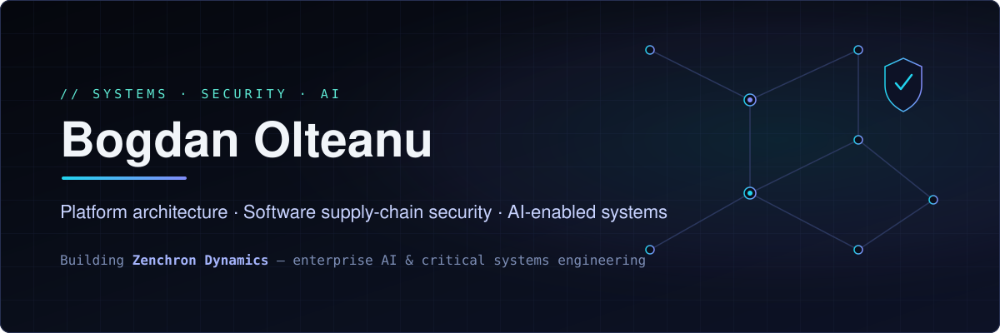

I design and build web platforms, developer infrastructure, and secure delivery systems — from architecture through production. My current focus is software supply-chain security and AI-enabled engineering: hardened container platforms, release gates that make security a measurable requirement, and governance for AI-assisted development. I'm building [Zenchron Dynamics](https://zenchron.com), where we work on enterprise AI and critical systems.

**[Zenchron Dynamics](https://zenchron.com)** · **[Sentinel Shield](https://github.com/bogdaniel/sentinel-shield)** · **[@zenchron-dynamics](https://github.com/zenchron-dynamics)**

---

## Selected systems

### [Sentinel Shield](https://github.com/bogdaniel/sentinel-shield) — security & release-gate baseline
Reusable security, quality, and release-gate engine for code, containers, CI, and infrastructure. Encodes the decisions teams re-solve on every project — which analysers run, how strict CI is, when a release may ship — as enforceable gates instead of best-effort habits.
**Role:** creator & maintainer · **Stack:** Semgrep rules, OPA/Rego policies, SBOM (Syft), secret & vulnerability scanning, reusable GitHub Actions, per-stack profiles (PHP/Laravel/Symfony, Node, Docker) · **Status:** released — [v2.x engine-only line](https://github.com/bogdaniel/sentinel-shield/releases), CI green, actively maintained.

### [Zenchron Foundry](https://github.com/zenchron-dynamics/zenchron-foundry) — hardened container platform
Golden-image platform producing hardened, signed, scanned, SBOM-backed base images for PHP workloads (`php-fpm`, `php-cli`, workers, FrankenPHP, nginx, Caddy), published multi-arch to GHCR. Digest-pinned Debian-first bases, machine-enforced ownership boundaries, version-bound risk acceptance, and ADR-driven platform decisions.
**Role:** primary author of the public change history · **Stack:** Docker, GitHub Actions, cosign-style signing & provenance, SBOM/CVE ledgers · **Status:** in production use at Zenchron, actively maintained.

### [Aegis Codex](https://github.com/bogdaniel/aegis-codex) — governance for AI-assisted development
A rules and governance catalog for LLM-assisted engineering on serious systems: Clean/Hexagonal architecture, DDD, threat modeling, change control, and multi-agent orchestration encoded as machine-readable rules (Cursor-compatible) so the policy lives in the repo, not in prompts.
**Role:** creator · **Stack:** rule DSL (`.mdc`), agent role definitions, docs for security/testing/observability/CI standards · **Status:** usable, evolving with AI tooling.

### [Aether](https://github.com/bogdaniel/aether) — state orchestration for agent swarms *(experiment)*
Early-stage Rust engine exploring content-addressed task state for AI agent swarms: typed state machines that make invalid transitions structurally impossible, SHA-256 addressable work units, offline ONNX semantic search, and OpenTelemetry tracing on every state change.
**Role:** creator · **Status:** experimental prototype — an architecture exploration, not a production claim.

---

## Engineering focus

- **Web platforms & backend architecture** — public work in PHP/Symfony/Laravel going back to 2011, plus Node/TypeScript systems; clean boundaries, DDD where it pays for itself, refactoring legacy schemas under test (see [product-schema-refactor](https://github.com/bogdaniel/product-schema-refactor)).
- **Infrastructure, containers & delivery** — Docker-first platforms, multi-arch image pipelines, reproducible CI/CD, GitHub Actions at the platform level rather than per-repo copy-paste.
- **Software supply-chain security** — SBOMs, signing, provenance, CVE ledgers with version-bound risk acceptance, secret scanning, and release gates that block instead of warn.
- **AI agents & automation** — governance-first AI-assisted development, agent orchestration, and the infrastructure that keeps autonomous tooling deterministic and auditable.

## Principles

- Security is a release requirement, not a best-effort activity.
- Evidence over claims — status files, gates, and ledgers beat promises in a README.
- Automation needs explicit safety controls; an agent without gates is a liability.
- Boring, digest-pinned, reproducible foundations outlast clever ones.

## Working together

I'm open to senior architecture and platform-engineering conversations, supply-chain-security adoption work, and collaboration on the open-source systems above. Issues and PRs on any of my repositories are welcome.

**Start a conversation via [zenchron.com](https://zenchron.com).**
